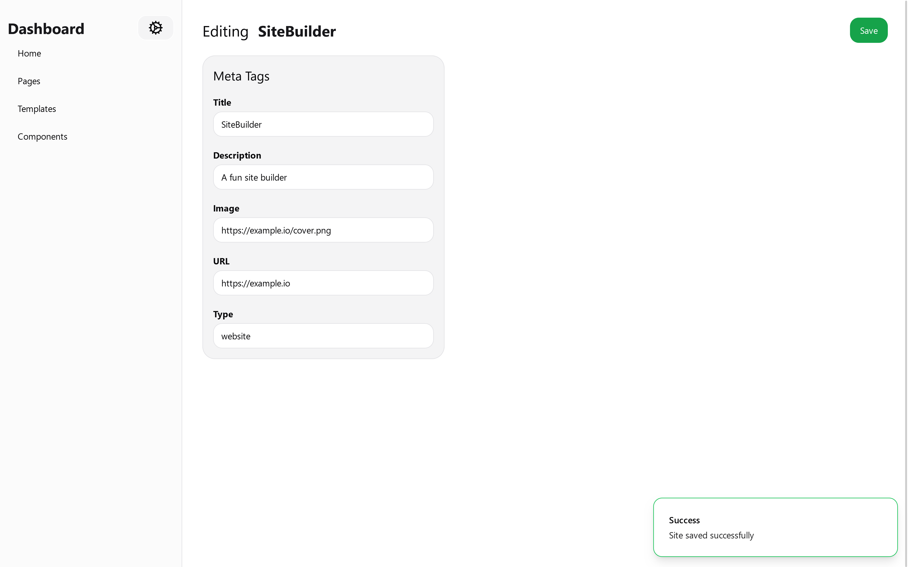
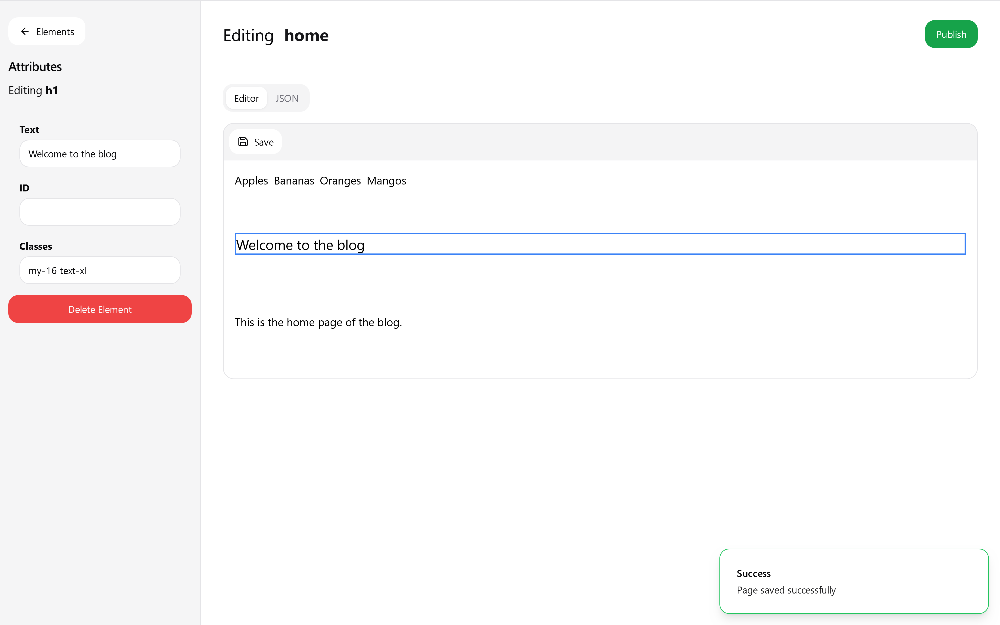
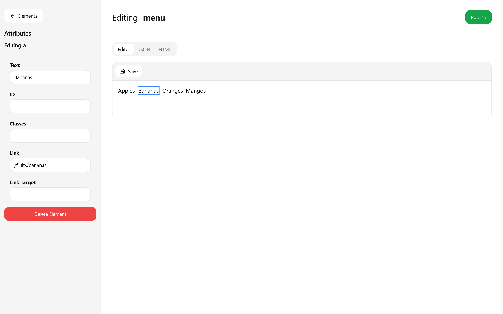

# juno

> [!WARNING]  
> This project is still in development and is not yet ready for production use.

An open-source page builder for building static websites.

Under the hood, Juno transforms HTML to JSON and vice versa. This enables you to build your website using a drag-and-drop editor or by writing HTML directly.

## Features

- Pages
- Templates
- Components
- Drag-and-drop editor
- TailwindCSS support
- Site-wide settings (meta tags, site name, etc.)

## Tech Stack

- [Vue 3](https://v3.vuejs.org/)
- [Express 5](https://expressjs.com/)
- [MongoDB](https://www.mongodb.com/)

## Installation

You will need to have MongoDB installed on your machine or you can use a cloud service like [MongoDB Atlas](https://www.mongodb.com/cloud/atlas).

```bash
git clone https://github.com/dmdboi/juno.git
cd juno
npm install
npm run dev
```

You will need to create a `.env` file in the root directory with the following variables:

```bash
MONGO_DB_URI=your_mongo_db_uri
PORT=your_port
```

## Usage

This starts both the backend and frontend servers. The backend server runs on your .env port and the frontend runs on port 5173.

```bash
npm run dev
```

## Contributing

Pull requests are welcome. For major changes, please open an issue first to discuss what you would like to change.

## Screenshots

Site Settings 

Page Editor 

Component Editor 
